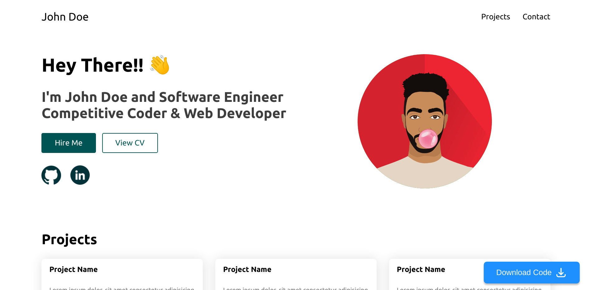

<!--
*** Thanks for checking out the Best-README-Template. If you have a suggestion
*** that would make this better, please fork the repo and create a pull request
*** or simply open an issue with the tag "enhancement".
*** Thanks again! Now go create something AMAZING! :D
***
***
***
*** To avoid retyping too much info. Do a search and replace for the following:
*** DSCVITBHOPAL, Portfolio-Generator, twitter_handle, email, Portfolio Generator, A Portfolio Generator website developed using NextJS
-->

<!-- PROJECT SHIELDS -->
<!--
*** I'm using markdown "reference style" links for readability.
*** Reference links are enclosed in brackets [ ] instead of parentheses ( ).
*** See the bottom of this document for the declaration of the reference variables
*** for contributors-url, forks-url, etc. This is an optional, concise syntax you may use.
*** https://www.markdownguide.org/basic-syntax/#reference-style-links
-->

[![Contributors][contributors-shield]][contributors-url]
[![Forks][forks-shield]][forks-url]
[![Stargazers][stars-shield]][stars-url]
[![Issues][issues-shield]][issues-url]
[![MIT License][license-shield]][license-url]

<!-- [![LinkedIn][linkedin-shield]][linkedin-url] -->

<!-- PROJECT LOGO -->
<br />
<p align="center">
  <a href="https://github.com/DSCVITBHOPAL/Portfolio-Generator">
    
  </a>

  <h3 align="center">Portfolio Generator</h3>

  <p align="center">
    A Portfolio Generator website developed using NextJS
    <br />
    <a href="https://github.com/DSCVITBHOPAL/Portfolio-Generator"><strong>Explore the docs »</strong></a>
    <br />
    <br />
    <a href="https://github.com/DSCVITBHOPAL/Portfolio-Generator">View Demo</a>
    ·
    <a href="https://github.com/DSCVITBHOPAL/Portfolio-Generator/issues">Report Bug</a>
    ·
    <a href="https://github.com/DSCVITBHOPAL/Portfolio-Generator/issues">Request Feature</a>
  </p>
</p>

<!-- TABLE OF CONTENTS -->
<details open="open">
  <summary><h2 style="display: inline-block">Table of Contents</h2></summary>
  <ol>
    <li>
      <a href="#about-the-project">About The Project</a>
      <ul>
        <li><a href="#built-with">Built With</a></li>
      </ul>
    </li>
    <li>
      <a href="#getting-started">Getting Started</a>
      <ul>
        <li><a href="#prerequisites">Prerequisites</a></li>
        <li><a href="#installation">Installation</a></li>
      </ul>
    </li>
    <li><a href="#roadmap">Roadmap</a></li>
    <li><a href="#contributing">Contributing</a></li>
    <li><a href="#license">License</a></li>
    <li><a href="#contact">Contact</a></li>
  </ol>
</details>

<!-- ABOUT THE PROJECT -->

## About The Project

A Portfolio Generator website developed using NextJS


### Built With

- [NextJS](https://nextjs.org/)
- [styled-components](https://styled-components.com/)
- [ReactJS](https://reactjs.org/)

<!-- GETTING STARTED -->

### Prerequisites

This is an example of how to list things you need to use the software and how to install them.

- npm
  ```sh
  npm i npm@latest -g
  # or
  npm i -g yarn
  ```

### Installation

1. Clone the repo
   ```sh
   git clone https://github.com/DSCVITBHOPAL/Portfolio-Generator.git
   ```
2. Install NPM packages
   ```sh
   npm i
   # or
   yarn
   ```

<!-- USAGE EXAMPLES -->

### Getting Started

First, run the development server:

```bash
npm run dev
# or
yarn dev
```

Open [http://localhost:3000](http://localhost:3000) with your browser to see the result.

You can start editing the page by modifying `pages/index.tsx`. The page auto-updates as you edit the file.

<!-- ROADMAP -->

## Roadmap

See the [open issues](https://github.com/DSCVITBHOPAL/Portfolio-Generator/issues) for a list of proposed features (and known issues).

<!-- CONTRIBUTING -->

## Contributing

Contributions are what make the open source community such an amazing place to learn, inspire, and create. Any contributions you make are **greatly appreciated**.

1. Fork the Project
2. Create your Feature Branch (`git checkout -b feature/AmazingFeature`)
3. Commit your Changes (`git commit -m 'Add some AmazingFeature'`)
4. Push to the Branch (`git push origin feature/AmazingFeature`)
5. Open a Pull Request

Creating an Issue

1. Try to give a thorough description of issue so that it can be easily understood
2. Try providing scshots or ways to reproduce the errors if possible

Working on an Issue

1. Try to get the issue assined to you before working to avoid multiple people working on same issue

## Points System💻

We decided to come up with a point system for all of our repositories under GDSC, VIT Bhopal and here's how it looks.
| Levels | Task | Points |
| :--- | :---: | ---: |
| Level 0 | Documentation & Minor Fixes | 5 |
| Level 1 | Minor Feature addition & Major Bug Fixes | 10 |
| Level 2 | Major Feature or Component | 15 |

This how the points will be awarded for your respective contributions. This will help us reward our contributors at the end of the year.

<!-- LICENSE -->

## License

Distributed under the MIT License. See `LICENSE` for more information.

<!-- CONTACT -->

## Contact

Project Link: [https://github.com/DSCVITBHOPAL/Portfolio-Generator](https://github.com/DSCVITBHOPAL/Portfolio-Generator)

<!-- ACKNOWLEDGEMENTS -->
<!--
## Acknowledgements

- []()
- []()
- []() -->

<!-- MARKDOWN LINKS & IMAGES -->
<!-- https://www.markdownguide.org/basic-syntax/#reference-style-links -->

[contributors-shield]: https://img.shields.io/github/contributors/DSCVITBHOPAL/Portfolio-Generator.svg?style=for-the-badge
[contributors-url]: https://github.com/DSCVITBHOPAL/Portfolio-Generator/graphs/contributors
[forks-shield]: https://img.shields.io/github/forks/DSCVITBHOPAL/Portfolio-Generator.svg?style=for-the-badge
[forks-url]: https://github.com/DSCVITBHOPAL/Portfolio-Generator/network/members
[stars-shield]: https://img.shields.io/github/stars/DSCVITBHOPAL/Portfolio-Generator.svg?style=for-the-badge
[stars-url]: https://github.com/DSCVITBHOPAL/Portfolio-Generator/stargazers
[issues-shield]: https://img.shields.io/github/issues/DSCVITBHOPAL/Portfolio-Generator.svg?style=for-the-badge
[issues-url]: https://github.com/DSCVITBHOPAL/Portfolio-Generator/issues
[license-shield]: https://img.shields.io/github/license/DSCVITBHOPAL/Portfolio-Generator.svg?style=for-the-badge
[license-url]: https://github.com/DSCVITBHOPAL/Portfolio-Generator/blob/master/LICENSE.txt
[linkedin-shield]: https://img.shields.io/badge/-LinkedIn-black.svg?style=for-the-badge&logo=linkedin&colorB=555
[linkedin-url]: https://linkedin.com/in/DSCVITBHOPAL
